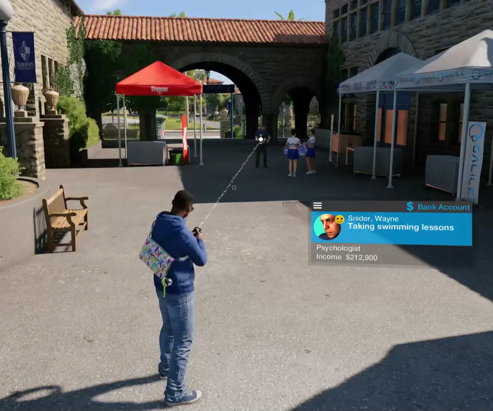

One of my favourite things to do in [Watch Dogs 2](https://en.wikipedia.org/wiki/Watch_Dogs_2) is to peer into the lives
of the NPCs using the profiler. Curious, I wanted to know what all the possible profiler messages were.

`data.json` contains all the messages.

For example "Taking swimming lessons" can be found on line [2744](https://github.com/jean-jacket/wd2-profiler/blob/main/data.json#L2744)

